# AI Engineering and Operations Copilot - System Architecture

## Overview

An AI-powered platform that transforms system complexity, production incidents, and manual workflows into instant explanations, root-cause insights, and automated solutions.

## Core Capabilities

1. **Incident Response & Root-Cause Analysis**
   - Automated incident detection and triage
   - AI-powered root-cause analysis
   - Intelligent remediation suggestions
   - Historical incident pattern recognition

2. **System Understanding & Documentation**
   - Automatic system topology mapping
   - Dependency visualization
   - Natural language system queries
   - Living documentation generation

3. **Workflow Automation**
   - Automated operational tasks
   - Intelligent runbook execution
   - Self-healing capabilities
   - Custom workflow orchestration

## High-Level Architecture

```mermaid
graph TB
    subgraph "User Interface Layer"
        UI[Web Dashboard]
        CLI[CLI Tool]
        API_CLIENT[API Clients]
    end

    subgraph "API Gateway Layer"
        GATEWAY[FastAPI Gateway]
        AUTH[Authentication/Authorization]
        RATE_LIMIT[Rate Limiting]
    end

    subgraph "Core Services"
        INCIDENT[Incident Response Service]
        SYSTEM[System Understanding Service]
        WORKFLOW[Workflow Automation Service]
        CHAT[Conversational AI Service]
    end

    subgraph "AI/LLM Layer"
        LLM_ROUTER[LLM Router/Abstraction]
        OPENAI[OpenAI GPT-4]
        CLAUDE[Anthropic Claude]
        OLLAMA[Ollama/Open-Source]
        RAG[RAG Engine]
        VECTOR_DB[Vector Database]
    end

    subgraph "Integration Layer"
        INT_FRAMEWORK[Integration Framework]
        OBS[Observability Connectors]
        INCIDENT_MGT[Incident Management Connectors]
        INFRA[Infrastructure Connectors]
    end

    subgraph "Data Layer"
        POSTGRES[(PostgreSQL)]
        REDIS[(Redis Cache)]
        TIMESERIES[(TimescaleDB)]
        OBJECT_STORE[(Object Storage)]
    end

    subgraph "External Systems"
        PROMETHEUS[Prometheus/Grafana]
        DATADOG[Datadog/New Relic]
        ELK[ELK/Splunk]
        PAGERDUTY[PagerDuty/Opsgenie]
        JIRA[Jira/ServiceNow]
        AWS[AWS/Azure/GCP]
        K8S[Kubernetes]
    end

    UI --> GATEWAY
    CLI --> GATEWAY
    API_CLIENT --> GATEWAY
    
    GATEWAY --> AUTH
    GATEWAY --> RATE_LIMIT
    GATEWAY --> INCIDENT
    GATEWAY --> SYSTEM
    GATEWAY --> WORKFLOW
    GATEWAY --> CHAT

    INCIDENT --> LLM_ROUTER
    SYSTEM --> LLM_ROUTER
    WORKFLOW --> LLM_ROUTER
    CHAT --> LLM_ROUTER

    LLM_ROUTER --> OPENAI
    LLM_ROUTER --> CLAUDE
    LLM_ROUTER --> OLLAMA
    LLM_ROUTER --> RAG

    RAG --> VECTOR_DB

    INCIDENT --> INT_FRAMEWORK
    SYSTEM --> INT_FRAMEWORK
    WORKFLOW --> INT_FRAMEWORK

    INT_FRAMEWORK --> OBS
    INT_FRAMEWORK --> INCIDENT_MGT
    INT_FRAMEWORK --> INFRA

    OBS --> PROMETHEUS
    OBS --> DATADOG
    OBS --> ELK

    INCIDENT_MGT --> PAGERDUTY
    INCIDENT_MGT --> JIRA

    INFRA --> AWS
    INFRA --> K8S

    INCIDENT --> POSTGRES
    SYSTEM --> POSTGRES
    WORKFLOW --> POSTGRES
    CHAT --> POSTGRES

    INCIDENT --> REDIS
    SYSTEM --> REDIS
    WORKFLOW --> REDIS

    INCIDENT --> TIMESERIES
    SYSTEM --> TIMESERIES

    RAG --> OBJECT_STORE
```



## Technology Stack

### Backend
- **Framework**: FastAPI (Python 3.11+)
- **API**: RESTful + WebSocket for real-time updates
- **Authentication**: JWT + OAuth2
- **Task Queue**: Celery + Redis
- **Background Jobs**: APScheduler

### Frontend
- **Framework**: React 18 + TypeScript
- **State Management**: Redux Toolkit + RTK Query
- **UI Components**: Material-UI (MUI)
- **Visualization**: D3.js, Recharts
- **Real-time**: Socket.io client

### Data Storage
- **Primary Database**: PostgreSQL 15
- **Time-Series Data**: TimescaleDB extension
- **Cache**: Redis 7
- **Vector Database**: Qdrant or Pinecone
- **Object Storage**: MinIO (S3-compatible)

### AI/LLM Integration
- **OpenAI**: GPT-4, GPT-4-turbo
- **Anthropic**: Claude 3 (Opus, Sonnet)
- **Open-Source**: Llama 3, Mistral via Ollama
- **Embeddings**: OpenAI text-embedding-3, sentence-transformers
- **RAG Framework**: LangChain

### DevOps & Infrastructure
- **Containerization**: Docker + Docker Compose
- **Orchestration**: Kubernetes (future)
- **CI/CD**: GitHub Actions
- **Monitoring**: Prometheus + Grafana
- **Logging**: ELK Stack
- **Tracing**: OpenTelemetry

## Core Modules

### 1. Incident Response Module

**Purpose**: Detect, analyze, and resolve production incidents with AI assistance.

**Key Features**:
- Real-time incident detection from multiple sources
- Automated severity classification
- Root-cause analysis using historical data and AI
- Intelligent remediation suggestions
- Incident timeline reconstruction
- Post-mortem generation

**Components**:
- Incident Detector
- Root-Cause Analyzer
- Remediation Engine
- Timeline Builder
- Post-Mortem Generator

### 2. System Understanding Module

**Purpose**: Provide instant insights into system architecture, dependencies, and behavior.

**Key Features**:
- Automatic service discovery and mapping
- Dependency graph visualization
- Natural language system queries
- Configuration analysis
- Performance bottleneck identification
- Documentation generation

**Components**:
- Service Discovery Engine
- Dependency Mapper
- Query Processor
- Documentation Generator
- Topology Visualizer

### 3. Workflow Automation Module

**Purpose**: Automate repetitive operational tasks and enable self-healing systems.

**Key Features**:
- Workflow definition and execution
- Intelligent runbook automation
- Self-healing triggers and actions
- Custom workflow builder
- Approval workflows
- Rollback capabilities

**Components**:
- Workflow Engine
- Runbook Executor
- Self-Healing Controller
- Workflow Builder UI
- Approval Manager

### 4. Conversational AI Interface

**Purpose**: Enable natural language interaction with the platform.

**Key Features**:
- Multi-turn conversations
- Context-aware responses
- Command execution via chat
- Proactive suggestions
- Multi-modal input (text, voice future)

**Components**:
- Chat Manager
- Context Handler
- Intent Classifier
- Response Generator
- Command Executor

### 5. Knowledge Base & RAG System

**Purpose**: Store and retrieve organizational knowledge for AI-enhanced responses.

**Key Features**:
- Document ingestion (runbooks, docs, tickets)
- Semantic search
- Context-aware retrieval
- Knowledge graph construction
- Automatic knowledge updates

**Components**:
- Document Processor
- Embedding Generator
- Vector Store Manager
- Retrieval Engine
- Knowledge Graph Builder

## Integration Framework

### Design Principles
- **Plugin Architecture**: Easy to add new integrations
- **Standardized Interface**: Common API for all connectors
- **Error Handling**: Robust retry and fallback mechanisms
- **Rate Limiting**: Respect external API limits
- **Caching**: Minimize external API calls

### Integration Categories

#### Observability Integrations
- Prometheus/Grafana
- Datadog
- New Relic
- ELK Stack
- Splunk
- Custom metrics endpoints

#### Incident Management Integrations
- PagerDuty
- Opsgenie
- Jira
- ServiceNow
- Linear
- GitHub Issues

#### Infrastructure Integrations
- AWS (EC2, ECS, Lambda, CloudWatch)
- Azure (VMs, AKS, Monitor)
- GCP (Compute, GKE, Monitoring)
- Kubernetes API
- Docker API
- Terraform State

## Data Models

### Core Entities

#### Incident
```python
{
  "id": "uuid",
  "title": "string",
  "description": "string",
  "severity": "critical|high|medium|low",
  "status": "open|investigating|resolved|closed",
  "source": "string",
  "detected_at": "timestamp",
  "resolved_at": "timestamp",
  "affected_services": ["service_ids"],
  "root_cause": "string",
  "remediation_steps": ["steps"],
  "timeline": [{"timestamp", "event", "actor"}],
  "metadata": "json"
}
```

#### System/Service
```python
{
  "id": "uuid",
  "name": "string",
  "type": "service|database|queue|cache",
  "environment": "production|staging|development",
  "dependencies": ["service_ids"],
  "health_status": "healthy|degraded|down",
  "metrics": "json",
  "configuration": "json",
  "documentation": "text",
  "metadata": "json"
}
```

#### Workflow
```python
{
  "id": "uuid",
  "name": "string",
  "description": "string",
  "trigger_type": "manual|scheduled|event|self_healing",
  "trigger_config": "json",
  "steps": [{"action", "parameters", "conditions"}],
  "approval_required": "boolean",
  "status": "active|paused|archived",
  "execution_history": ["execution_ids"],
  "metadata": "json"
}
```

#### Knowledge Document
```python
{
  "id": "uuid",
  "title": "string",
  "content": "text",
  "type": "runbook|documentation|incident_report",
  "source": "string",
  "embedding": "vector",
  "tags": ["strings"],
  "created_at": "timestamp",
  "updated_at": "timestamp",
  "metadata": "json"
}
```

## Security Considerations

### Authentication & Authorization
- JWT-based authentication
- Role-based access control (RBAC)
- API key management for integrations
- OAuth2 for third-party integrations
- Multi-factor authentication (MFA)

### Data Security
- Encryption at rest (database, object storage)
- Encryption in transit (TLS 1.3)
- Secrets management (HashiCorp Vault or AWS Secrets Manager)
- PII/sensitive data masking
- Audit logging for all operations

### Network Security
- API rate limiting
- DDoS protection
- IP whitelisting for sensitive operations
- Network segmentation
- VPC/private networking

## Scalability & Performance

### Horizontal Scaling
- Stateless API services
- Load balancing (NGINX/HAProxy)
- Database read replicas
- Redis cluster for caching
- Message queue for async processing

### Performance Optimization
- Response caching (Redis)
- Database query optimization
- Connection pooling
- Lazy loading for large datasets
- CDN for static assets

### Monitoring & Observability
- Application metrics (Prometheus)
- Distributed tracing (OpenTelemetry)
- Centralized logging (ELK)
- Real-time alerting
- Performance profiling

## Deployment Architecture

### Development Environment
- Docker Compose for local development
- Hot-reload for rapid iteration
- Mock external services
- Seed data for testing

### Production Environment
- Multi-container deployment
- Database backups and replication
- Blue-green deployment strategy
- Auto-scaling based on load
- Disaster recovery plan

## Future Enhancements

### Phase 2 Features
- Voice interface integration
- Mobile applications (iOS/Android)
- Advanced ML models for prediction
- Multi-tenancy support
- Marketplace for custom integrations

### Phase 3 Features
- Microservices architecture migration
- Global deployment (multi-region)
- Advanced analytics and reporting
- AI model fine-tuning on organizational data
- Collaborative features (team chat, shared dashboards)

## Success Metrics

### Technical Metrics
- API response time < 200ms (p95)
- System uptime > 99.9%
- Incident detection latency < 30 seconds
- AI response accuracy > 90%

### Business Metrics
- Mean time to detection (MTTD) reduction
- Mean time to resolution (MTTR) reduction
- Reduction in manual operational tasks
- User satisfaction score
- Cost savings from automation

## Development Phases

### Phase 1: Foundation (Weeks 1-4)
- Project setup and infrastructure
- Core API framework
- Database schema
- Basic authentication
- LLM abstraction layer

### Phase 2: Core Features (Weeks 5-10)
- Incident response module
- System understanding module
- Basic integrations (2-3 per category)
- Conversational AI interface
- Basic UI dashboard

### Phase 3: Advanced Features (Weeks 11-16)
- Workflow automation module
- RAG system and knowledge base
- Additional integrations
- Advanced UI features
- Testing and optimization

### Phase 4: Production Ready (Weeks 17-20)
- Security hardening
- Performance optimization
- Documentation
- Deployment automation
- Monitoring and alerting