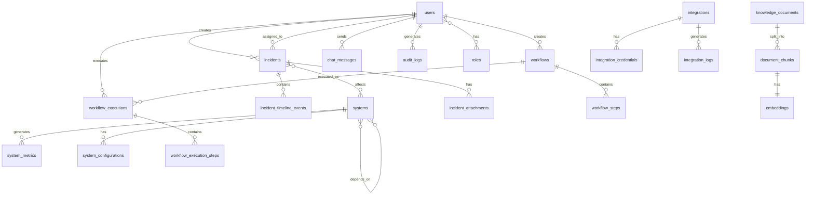

# Database Schema Documentation

## Overview

The AI Engineering and Operations Copilot uses PostgreSQL 15 with the TimescaleDB extension for time-series data. This document provides a comprehensive overview of the database schema, relationships, and design decisions.

## Entity Relationship Diagram



## Core Tables

### 1. Users Table

Stores user accounts and authentication information.

```sql
CREATE TABLE users (
    id UUID PRIMARY KEY DEFAULT gen_random_uuid(),
    email VARCHAR(255) UNIQUE NOT NULL,
    username VARCHAR(100) UNIQUE NOT NULL,
    password_hash VARCHAR(255) NOT NULL,
    full_name VARCHAR(255),
    is_active BOOLEAN DEFAULT true,
    is_superuser BOOLEAN DEFAULT false,
    last_login_at TIMESTAMP WITH TIME ZONE,
    created_at TIMESTAMP WITH TIME ZONE DEFAULT CURRENT_TIMESTAMP,
    updated_at TIMESTAMP WITH TIME ZONE DEFAULT CURRENT_TIMESTAMP,
    
    CONSTRAINT email_format CHECK (email ~* '^[A-Za-z0-9._%+-]+@[A-Za-z0-9.-]+\.[A-Za-z]{2,}$')
);

CREATE INDEX idx_users_email ON users(email);
CREATE INDEX idx_users_username ON users(username);
CREATE INDEX idx_users_is_active ON users(is_active);
```

**Key Fields**:
- `id`: Unique identifier (UUID)
- `email`: User's email address (unique, used for login)
- `password_hash`: Bcrypt hashed password
- `is_active`: Soft delete flag
- `is_superuser`: Admin privileges flag

### 2. Roles Table

Defines user roles for RBAC (Role-Based Access Control).

```sql
CREATE TABLE roles (
    id UUID PRIMARY KEY DEFAULT gen_random_uuid(),
    name VARCHAR(100) UNIQUE NOT NULL,
    description TEXT,
    permissions JSONB NOT NULL DEFAULT '[]',
    created_at TIMESTAMP WITH TIME ZONE DEFAULT CURRENT_TIMESTAMP,
    updated_at TIMESTAMP WITH TIME ZONE DEFAULT CURRENT_TIMESTAMP
);

CREATE TABLE user_roles (
    user_id UUID REFERENCES users(id) ON DELETE CASCADE,
    role_id UUID REFERENCES roles(id) ON DELETE CASCADE,
    assigned_at TIMESTAMP WITH TIME ZONE DEFAULT CURRENT_TIMESTAMP,
    assigned_by UUID REFERENCES users(id),
    
    PRIMARY KEY (user_id, role_id)
);

CREATE INDEX idx_user_roles_user_id ON user_roles(user_id);
CREATE INDEX idx_user_roles_role_id ON user_roles(role_id);
```

**Default Roles**:
- `admin`: Full system access
- `engineer`: Read/write access to incidents, systems, workflows
- `viewer`: Read-only access
- `operator`: Execute workflows, manage incidents

### 3. Incidents Table

Stores incident records and their metadata.

```sql
CREATE TABLE incidents (
    id UUID PRIMARY KEY DEFAULT gen_random_uuid(),
    title VARCHAR(500) NOT NULL,
    description TEXT,
    severity VARCHAR(20) NOT NULL CHECK (severity IN ('critical', 'high', 'medium', 'low')),
    status VARCHAR(20) NOT NULL CHECK (status IN ('open', 'investigating', 'identified', 'resolved', 'closed')),
    source VARCHAR(100),
    source_id VARCHAR(255),
    
    detected_at TIMESTAMP WITH TIME ZONE NOT NULL,
    acknowledged_at TIMESTAMP WITH TIME ZONE,
    resolved_at TIMESTAMP WITH TIME ZONE,
    closed_at TIMESTAMP WITH TIME ZONE,
    
    root_cause TEXT,
    root_cause_confidence DECIMAL(3,2) CHECK (root_cause_confidence >= 0 AND root_cause_confidence <= 1),
    remediation_steps JSONB DEFAULT '[]',
    
    created_by UUID REFERENCES users(id),
    assigned_to UUID REFERENCES users(id),
    
    metadata JSONB DEFAULT '{}',
    tags TEXT[] DEFAULT '{}',
    
    created_at TIMESTAMP WITH TIME ZONE DEFAULT CURRENT_TIMESTAMP,
    updated_at TIMESTAMP WITH TIME ZONE DEFAULT CURRENT_TIMESTAMP,
    
    CONSTRAINT valid_timestamps CHECK (
        detected_at <= COALESCE(acknowledged_at, detected_at) AND
        COALESCE(acknowledged_at, detected_at) <= COALESCE(resolved_at, acknowledged_at, detected_at) AND
        COALESCE(resolved_at, acknowledged_at, detected_at) <= COALESCE(closed_at, resolved_at, acknowledged_at, detected_at)
    )
);

CREATE INDEX idx_incidents_severity ON incidents(severity);
CREATE INDEX idx_incidents_status ON incidents(status);
CREATE INDEX idx_incidents_detected_at ON incidents(detected_at DESC);
CREATE INDEX idx_incidents_assigned_to ON incidents(assigned_to);
CREATE INDEX idx_incidents_tags ON incidents USING GIN(tags);
CREATE INDEX idx_incidents_metadata ON incidents USING GIN(metadata);
```

**Key Fields**:
- `severity`: Incident severity level
- `status`: Current incident status
- `root_cause`: AI-generated root cause analysis
- `root_cause_confidence`: Confidence score (0-1)
- `remediation_steps`: Array of suggested remediation actions

### 4. Incident Timeline Events

Tracks all events related to an incident.

```sql
CREATE TABLE incident_timeline_events (
    id UUID PRIMARY KEY DEFAULT gen_random_uuid(),
    incident_id UUID REFERENCES incidents(id) ON DELETE CASCADE,
    event_type VARCHAR(50) NOT NULL,
    event_data JSONB NOT NULL DEFAULT '{}',
    actor_id UUID REFERENCES users(id),
    actor_type VARCHAR(50) DEFAULT 'user',
    timestamp TIMESTAMP WITH TIME ZONE DEFAULT CURRENT_TIMESTAMP,
    
    CONSTRAINT valid_actor_type CHECK (actor_type IN ('user', 'system', 'integration'))
);

CREATE INDEX idx_timeline_incident_id ON incident_timeline_events(incident_id);
CREATE INDEX idx_timeline_timestamp ON incident_timeline_events(timestamp DESC);
CREATE INDEX idx_timeline_event_type ON incident_timeline_events(event_type);
```

**Event Types**:
- `created`: Incident created
- `status_changed`: Status updated
- `assigned`: Assigned to user
- `comment_added`: Comment added
- `analysis_completed`: Root cause analysis completed
- `remediation_applied`: Remediation action executed

### 5. Systems Table

Represents services, applications, and infrastructure components.

```sql
CREATE TABLE systems (
    id UUID PRIMARY KEY DEFAULT gen_random_uuid(),
    name VARCHAR(255) NOT NULL,
    type VARCHAR(50) NOT NULL CHECK (type IN ('service', 'database', 'queue', 'cache', 'api', 'frontend', 'backend', 'infrastructure')),
    environment VARCHAR(50) NOT NULL CHECK (environment IN ('production', 'staging', 'development', 'test')),
    
    description TEXT,
    repository_url VARCHAR(500),
    documentation_url VARCHAR(500),
    
    health_status VARCHAR(20) DEFAULT 'unknown' CHECK (health_status IN ('healthy', 'degraded', 'down', 'unknown')),
    health_check_url VARCHAR(500),
    last_health_check TIMESTAMP WITH TIME ZONE,
    
    configuration JSONB DEFAULT '{}',
    metadata JSONB DEFAULT '{}',
    tags TEXT[] DEFAULT '{}',
    
    created_at TIMESTAMP WITH TIME ZONE DEFAULT CURRENT_TIMESTAMP,
    updated_at TIMESTAMP WITH TIME ZONE DEFAULT CURRENT_TIMESTAMP,
    
    UNIQUE(name, environment)
);

CREATE INDEX idx_systems_name ON systems(name);
CREATE INDEX idx_systems_type ON systems(type);
CREATE INDEX idx_systems_environment ON systems(environment);
CREATE INDEX idx_systems_health_status ON systems(health_status);
CREATE INDEX idx_systems_tags ON systems USING GIN(tags);
```

### 6. System Dependencies

Tracks dependencies between systems.

```sql
CREATE TABLE system_dependencies (
    id UUID PRIMARY KEY DEFAULT gen_random_uuid(),
    system_id UUID REFERENCES systems(id) ON DELETE CASCADE,
    depends_on_id UUID REFERENCES systems(id) ON DELETE CASCADE,
    dependency_type VARCHAR(50) NOT NULL CHECK (dependency_type IN ('sync', 'async', 'data', 'api', 'event')),
    is_critical BOOLEAN DEFAULT false,
    metadata JSONB DEFAULT '{}',
    created_at TIMESTAMP WITH TIME ZONE DEFAULT CURRENT_TIMESTAMP,
    
    CONSTRAINT no_self_dependency CHECK (system_id != depends_on_id),
    UNIQUE(system_id, depends_on_id)
);

CREATE INDEX idx_dependencies_system_id ON system_dependencies(system_id);
CREATE INDEX idx_dependencies_depends_on_id ON system_dependencies(depends_on_id);
CREATE INDEX idx_dependencies_critical ON system_dependencies(is_critical);
```

### 7. System Metrics (TimescaleDB Hypertable)

Stores time-series metrics for systems.

```sql
CREATE TABLE system_metrics (
    time TIMESTAMP WITH TIME ZONE NOT NULL,
    system_id UUID NOT NULL REFERENCES systems(id) ON DELETE CASCADE,
    metric_name VARCHAR(100) NOT NULL,
    metric_value DOUBLE PRECISION NOT NULL,
    unit VARCHAR(50),
    tags JSONB DEFAULT '{}',
    
    PRIMARY KEY (time, system_id, metric_name)
);

-- Convert to TimescaleDB hypertable
SELECT create_hypertable('system_metrics', 'time');

-- Create indexes
CREATE INDEX idx_metrics_system_id ON system_metrics(system_id, time DESC);
CREATE INDEX idx_metrics_name ON system_metrics(metric_name, time DESC);
CREATE INDEX idx_metrics_tags ON system_metrics USING GIN(tags);

-- Create continuous aggregates for common queries
CREATE MATERIALIZED VIEW system_metrics_hourly
WITH (timescaledb.continuous) AS
SELECT
    time_bucket('1 hour', time) AS bucket,
    system_id,
    metric_name,
    AVG(metric_value) as avg_value,
    MAX(metric_value) as max_value,
    MIN(metric_value) as min_value,
    COUNT(*) as sample_count
FROM system_metrics
GROUP BY bucket, system_id, metric_name;
```

### 8. Workflows Table

Defines automated workflows and runbooks.

```sql
CREATE TABLE workflows (
    id UUID PRIMARY KEY DEFAULT gen_random_uuid(),
    name VARCHAR(255) NOT NULL,
    description TEXT,
    
    trigger_type VARCHAR(50) NOT NULL CHECK (trigger_type IN ('manual', 'scheduled', 'event', 'self_healing', 'webhook')),
    trigger_config JSONB NOT NULL DEFAULT '{}',
    
    is_active BOOLEAN DEFAULT true,
    requires_approval BOOLEAN DEFAULT false,
    
    created_by UUID REFERENCES users(id),
    updated_by UUID REFERENCES users(id),
    
    metadata JSONB DEFAULT '{}',
    tags TEXT[] DEFAULT '{}',
    
    created_at TIMESTAMP WITH TIME ZONE DEFAULT CURRENT_TIMESTAMP,
    updated_at TIMESTAMP WITH TIME ZONE DEFAULT CURRENT_TIMESTAMP
);

CREATE INDEX idx_workflows_name ON workflows(name);
CREATE INDEX idx_workflows_trigger_type ON workflows(trigger_type);
CREATE INDEX idx_workflows_is_active ON workflows(is_active);
CREATE INDEX idx_workflows_tags ON workflows USING GIN(tags);
```

### 9. Workflow Steps

Defines individual steps within a workflow.

```sql
CREATE TABLE workflow_steps (
    id UUID PRIMARY KEY DEFAULT gen_random_uuid(),
    workflow_id UUID REFERENCES workflows(id) ON DELETE CASCADE,
    step_order INTEGER NOT NULL,
    name VARCHAR(255) NOT NULL,
    action_type VARCHAR(100) NOT NULL,
    action_config JSONB NOT NULL DEFAULT '{}',
    
    condition JSONB DEFAULT '{}',
    on_success VARCHAR(20) DEFAULT 'continue' CHECK (on_success IN ('continue', 'stop', 'skip')),
    on_failure VARCHAR(20) DEFAULT 'stop' CHECK (on_failure IN ('continue', 'stop', 'retry', 'rollback')),
    retry_config JSONB DEFAULT '{"max_retries": 3, "delay_seconds": 5}',
    
    timeout_seconds INTEGER DEFAULT 300,
    
    created_at TIMESTAMP WITH TIME ZONE DEFAULT CURRENT_TIMESTAMP,
    updated_at TIMESTAMP WITH TIME ZONE DEFAULT CURRENT_TIMESTAMP,
    
    UNIQUE(workflow_id, step_order)
);

CREATE INDEX idx_workflow_steps_workflow_id ON workflow_steps(workflow_id, step_order);
```

### 10. Workflow Executions

Tracks workflow execution history.

```sql
CREATE TABLE workflow_executions (
    id UUID PRIMARY KEY DEFAULT gen_random_uuid(),
    workflow_id UUID REFERENCES workflows(id) ON DELETE SET NULL,
    
    status VARCHAR(20) NOT NULL CHECK (status IN ('pending', 'running', 'completed', 'failed', 'cancelled', 'awaiting_approval')),
    
    triggered_by UUID REFERENCES users(id),
    trigger_source VARCHAR(100),
    trigger_data JSONB DEFAULT '{}',
    
    started_at TIMESTAMP WITH TIME ZONE DEFAULT CURRENT_TIMESTAMP,
    completed_at TIMESTAMP WITH TIME ZONE,
    
    result JSONB DEFAULT '{}',
    error_message TEXT,
    
    approved_by UUID REFERENCES users(id),
    approved_at TIMESTAMP WITH TIME ZONE
);

CREATE INDEX idx_executions_workflow_id ON workflow_executions(workflow_id);
CREATE INDEX idx_executions_status ON workflow_executions(status);
CREATE INDEX idx_executions_started_at ON workflow_executions(started_at DESC);
CREATE INDEX idx_executions_triggered_by ON workflow_executions(triggered_by);
```

### 11. Knowledge Documents

Stores documentation, runbooks, and knowledge base articles.

```sql
CREATE TABLE knowledge_documents (
    id UUID PRIMARY KEY DEFAULT gen_random_uuid(),
    title VARCHAR(500) NOT NULL,
    content TEXT NOT NULL,
    content_type VARCHAR(50) NOT NULL CHECK (content_type IN ('markdown', 'html', 'text', 'pdf', 'docx')),
    
    document_type VARCHAR(50) NOT NULL CHECK (document_type IN ('runbook', 'documentation', 'incident_report', 'postmortem', 'guide', 'reference')),
    
    source VARCHAR(100),
    source_url VARCHAR(500),
    
    version INTEGER DEFAULT 1,
    is_published BOOLEAN DEFAULT false,
    
    created_by UUID REFERENCES users(id),
    updated_by UUID REFERENCES users(id),
    
    metadata JSONB DEFAULT '{}',
    tags TEXT[] DEFAULT '{}',
    
    created_at TIMESTAMP WITH TIME ZONE DEFAULT CURRENT_TIMESTAMP,
    updated_at TIMESTAMP WITH TIME ZONE DEFAULT CURRENT_TIMESTAMP
);

CREATE INDEX idx_documents_title ON knowledge_documents(title);
CREATE INDEX idx_documents_type ON knowledge_documents(document_type);
CREATE INDEX idx_documents_published ON knowledge_documents(is_published);
CREATE INDEX idx_documents_tags ON knowledge_documents USING GIN(tags);
CREATE INDEX idx_documents_created_at ON knowledge_documents(created_at DESC);
```

### 12. Document Chunks (for RAG)

Stores chunked documents for vector search.

```sql
CREATE TABLE document_chunks (
    id UUID PRIMARY KEY DEFAULT gen_random_uuid(),
    document_id UUID REFERENCES knowledge_documents(id) ON DELETE CASCADE,
    chunk_index INTEGER NOT NULL,
    content TEXT NOT NULL,
    token_count INTEGER,
    metadata JSONB DEFAULT '{}',
    
    created_at TIMESTAMP WITH TIME ZONE DEFAULT CURRENT_TIMESTAMP,
    
    UNIQUE(document_id, chunk_index)
);

CREATE INDEX idx_chunks_document_id ON document_chunks(document_id);
```

### 13. Embeddings (Vector Storage)

Stores vector embeddings for semantic search.

```sql
CREATE EXTENSION IF NOT EXISTS vector;

CREATE TABLE embeddings (
    id UUID PRIMARY KEY DEFAULT gen_random_uuid(),
    chunk_id UUID UNIQUE REFERENCES document_chunks(id) ON DELETE CASCADE,
    embedding vector(1536),  -- OpenAI text-embedding-3-small dimension
    model VARCHAR(100) NOT NULL,
    created_at TIMESTAMP WITH TIME ZONE DEFAULT CURRENT_TIMESTAMP
);

-- Create HNSW index for fast similarity search
CREATE INDEX idx_embeddings_vector ON embeddings USING hnsw (embedding vector_cosine_ops);
```

### 14. Integrations

Stores integration configurations.

```sql
CREATE TABLE integrations (
    id UUID PRIMARY KEY DEFAULT gen_random_uuid(),
    name VARCHAR(255) NOT NULL,
    type VARCHAR(100) NOT NULL,
    category VARCHAR(50) NOT NULL CHECK (category IN ('observability', 'incident_management', 'infrastructure', 'communication', 'other')),
    
    is_enabled BOOLEAN DEFAULT true,
    configuration JSONB NOT NULL DEFAULT '{}',
    
    last_sync_at TIMESTAMP WITH TIME ZONE,
    last_sync_status VARCHAR(20) CHECK (last_sync_status IN ('success', 'failed', 'partial')),
    
    created_by UUID REFERENCES users(id),
    updated_by UUID REFERENCES users(id),
    
    created_at TIMESTAMP WITH TIME ZONE DEFAULT CURRENT_TIMESTAMP,
    updated_at TIMESTAMP WITH TIME ZONE DEFAULT CURRENT_TIMESTAMP,
    
    UNIQUE(name, type)
);

CREATE INDEX idx_integrations_type ON integrations(type);
CREATE INDEX idx_integrations_category ON integrations(category);
CREATE INDEX idx_integrations_enabled ON integrations(is_enabled);
```

### 15. Chat Messages

Stores conversational AI chat history.

```sql
CREATE TABLE chat_messages (
    id UUID PRIMARY KEY DEFAULT gen_random_uuid(),
    session_id UUID NOT NULL,
    user_id UUID REFERENCES users(id),
    
    role VARCHAR(20) NOT NULL CHECK (role IN ('user', 'assistant', 'system')),
    content TEXT NOT NULL,
    
    context JSONB DEFAULT '{}',
    metadata JSONB DEFAULT '{}',
    
    created_at TIMESTAMP WITH TIME ZONE DEFAULT CURRENT_TIMESTAMP
);

CREATE INDEX idx_chat_session_id ON chat_messages(session_id, created_at);
CREATE INDEX idx_chat_user_id ON chat_messages(user_id);
CREATE INDEX idx_chat_created_at ON chat_messages(created_at DESC);
```

### 16. Audit Logs

Comprehensive audit trail for compliance.

```sql
CREATE TABLE audit_logs (
    id UUID PRIMARY KEY DEFAULT gen_random_uuid(),
    user_id UUID REFERENCES users(id),
    action VARCHAR(100) NOT NULL,
    resource_type VARCHAR(100) NOT NULL,
    resource_id UUID,
    
    changes JSONB DEFAULT '{}',
    ip_address INET,
    user_agent TEXT,
    
    status VARCHAR(20) CHECK (status IN ('success', 'failed')),
    error_message TEXT,
    
    created_at TIMESTAMP WITH TIME ZONE DEFAULT CURRENT_TIMESTAMP
);

CREATE INDEX idx_audit_user_id ON audit_logs(user_id);
CREATE INDEX idx_audit_action ON audit_logs(action);
CREATE INDEX idx_audit_resource ON audit_logs(resource_type, resource_id);
CREATE INDEX idx_audit_created_at ON audit_logs(created_at DESC);
```

## Relationships Summary

### One-to-Many Relationships
- `users` → `incidents` (creator)
- `users` → `workflows` (creator)
- `users` → `workflow_executions` (executor)
- `incidents` → `incident_timeline_events`
- `workflows` → `workflow_steps`
- `workflows` → `workflow_executions`
- `knowledge_documents` → `document_chunks`

### Many-to-Many Relationships
- `users` ↔ `roles` (via `user_roles`)
- `incidents` ↔ `systems` (via `incident_systems`)
- `systems` ↔ `systems` (via `system_dependencies`)

## Indexes Strategy

### Performance Indexes
- **Foreign Keys**: All foreign key columns have indexes
- **Timestamps**: Descending indexes on timestamp columns for recent data queries
- **Status Fields**: Indexes on frequently filtered status columns
- **JSONB Fields**: GIN indexes for JSONB columns that are queried
- **Full-Text Search**: GIN indexes on text arrays (tags)

### Composite Indexes
- `(system_id, time DESC)` on `system_metrics` for time-series queries
- `(workflow_id, step_order)` on `workflow_steps` for ordered retrieval
- `(session_id, created_at)` on `chat_messages` for conversation history

## Data Retention Policies

### TimescaleDB Retention
```sql
-- Retain raw metrics for 30 days
SELECT add_retention_policy('system_metrics', INTERVAL '30 days');

-- Retain hourly aggregates for 1 year
SELECT add_retention_policy('system_metrics_hourly', INTERVAL '1 year');
```

### Archive Strategy
- **Incidents**: Archive closed incidents after 2 years
- **Audit Logs**: Archive after 7 years (compliance requirement)
- **Chat Messages**: Archive after 90 days
- **Workflow Executions**: Archive after 6 months

## Backup Strategy

### Full Backups
- Daily full backups at 2 AM UTC
- Retention: 30 days
- Storage: S3-compatible object storage

### Incremental Backups
- Hourly WAL archiving
- Point-in-time recovery capability
- Retention: 7 days

### Replication
- Streaming replication to read replica
- Asynchronous replication for reporting queries
- Automatic failover configuration

## Migration Strategy

### Alembic Migrations
All schema changes are managed through Alembic migrations:

```bash
# Create new migration
alembic revision --autogenerate -m "description"

# Apply migrations
alembic upgrade head

# Rollback
alembic downgrade -1
```

### Zero-Downtime Migrations
1. Add new columns as nullable
2. Deploy application code that writes to both old and new columns
3. Backfill data
4. Deploy code that reads from new columns
5. Remove old columns

## Performance Considerations

### Query Optimization
- Use prepared statements for repeated queries
- Implement connection pooling (20-50 connections)
- Use `EXPLAIN ANALYZE` for slow queries
- Monitor query performance with pg_stat_statements

### Partitioning Strategy
- Consider partitioning `audit_logs` by month
- Consider partitioning `incident_timeline_events` by quarter
- TimescaleDB automatically partitions `system_metrics`

### Caching Strategy
- Cache frequently accessed data in Redis
- Cache duration: 5-60 minutes depending on data type
- Invalidate cache on updates

## Security Considerations

### Row-Level Security (RLS)
```sql
-- Enable RLS on sensitive tables
ALTER TABLE incidents ENABLE ROW LEVEL SECURITY;

-- Policy: Users can only see incidents they created or are assigned to
CREATE POLICY incident_access_policy ON incidents
    FOR SELECT
    USING (
        created_by = current_user_id() OR
        assigned_to = current_user_id() OR
        is_superuser()
    );
```

### Encryption
- Encrypt sensitive fields in `integration_credentials`
- Use PostgreSQL's pgcrypto extension
- Store encryption keys in HashiCorp Vault

### Access Control
- Principle of least privilege
- Separate read-only and read-write users
- Audit all schema changes

## Monitoring

### Key Metrics to Monitor
- Table sizes and growth rates
- Index usage and efficiency
- Query performance (slow query log)
- Connection pool utilization
- Replication lag
- Disk space usage

### Alerts
- Disk space < 20% free
- Replication lag > 10 seconds
- Connection pool > 80% utilized
- Slow queries > 1 second
- Failed backups

## Conclusion

This database schema provides a solid foundation for the AI Engineering and Operations Copilot. The design prioritizes:

1. **Scalability**: TimescaleDB for time-series data, proper indexing
2. **Performance**: Optimized queries, caching, connection pooling
3. **Flexibility**: JSONB for extensible metadata
4. **Compliance**: Comprehensive audit logging
5. **Reliability**: Backup and replication strategies

Regular reviews and optimizations based on actual usage patterns will ensure the database continues to perform well as the system scales.